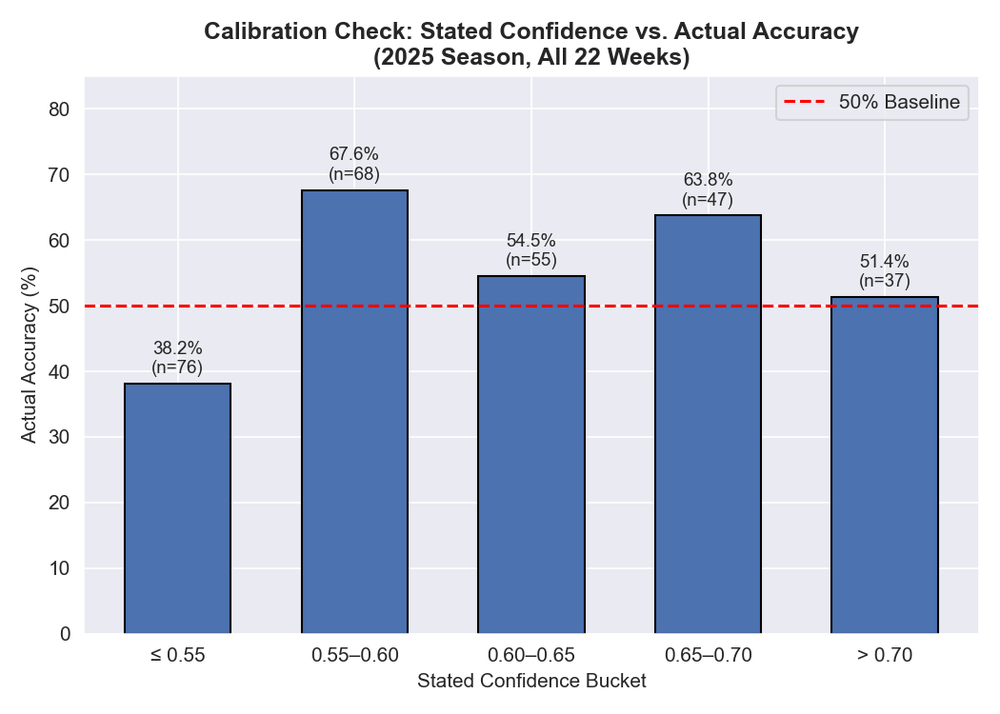
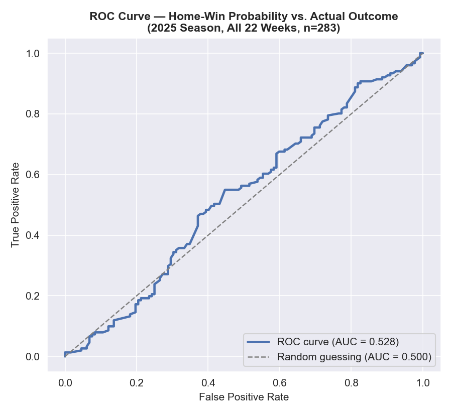

# NFL Game Outcome and Point Spread Prediction Using Ensemble Machine Learning

**Akul Aggarwal** · CS5100 — Foundations of Artificial Intelligence · August 2026

---

## 1. Introduction

### 1.1 Problem Statement

This project builds a machine learning system that predicts NFL game winners and point spreads before kickoff, using only information available beforehand (team statistics, schedule context, and market data through the prior week). It is framed as two coupled problems — binary classification (which team wins) and regression (by how many points) — generated and graded week-by-week across a full season, so the system is judged on 22 weeks of genuinely out-of-sample forecasts rather than one static test set.

### 1.2 Motivation and Goals

Predicting sports outcomes sits at an interesting intersection of applied ML and market-efficiency research: sports betting lines already aggregate large amounts of public information into a single number, making NFL prediction a meaningful test of whether a model can extract *additional* signal beyond what oddsmakers already price in. Spinosa (2018) and Fohey both find the NFL point-spread market largely efficient, with only small, hard-to-exploit inefficiencies — a realistic ceiling on how much a model should be expected to beat the market rather than just match it. Nate Silver's *The Signal and the Noise* (2012) frames sports forecasting more broadly as a useful laboratory for prediction under uncertainty, since outcomes are observed and graded quickly and objectively, unlike domains where "ground truth" arrives slowly.

The practical stakes are real: sports betting is a tens-of-billions-dollar industry, fantasy football involves tens of millions of participants, and NFL front offices increasingly invest in analytics. A system producing well-calibrated probabilities — not just a pick, but a trustworthy confidence level — has value across all three.

The goals of this project were to:

1. Build an end-to-end ML pipeline from data collection through weekly deployment.
2. Produce calibrated win probabilities, not raw classifier outputs.
3. Evaluate honestly on a full season of genuinely prospective, not retrospectively cherry-picked, predictions.
4. Identify which features most influence NFL outcomes.
5. Treat a mid-season architecture change as a natural experiment in whether added complexity helps.

---

## 2. Background

### 2.1 Related Work

NFL outcome prediction has a reasonable history in applied ML. Hamadani's Stanford CS229 project showed simple box-score features beat a 50% baseline. Beal, Norman, and Ramchurn (2020) tested nine classifiers on five seasons (1,280 games, 42 features) against bookmaker spreads and found no single classifier dominates, but ensembling narrows the gap to the market — directly motivating this project's multi-model ensemble (Random Forest, Logistic Regression, Gradient Boosting, XGBoost) over a single algorithm. Broader systematic reviews (arXiv:1912.11762, arXiv:2410.21484) confirm the feature categories used here — offensive/defensive efficiency, momentum, and contextual factors — are standard across sports prediction, and Fernandes et al. (2020) show interpretable, feature-engineered models remain competitive (75.3% accuracy on NFL play prediction) even as deep learning has grown more common in the field.

The calibration focus is informed by Wunderlich et al. (University of Bath, arXiv:2303.06021), who show sports-betting models optimized for accuracy alone can perform far worse in realized return than calibration-optimized ones (110% vs. 3% return in their study) — the primary justification for wrapping every classifier here in `CalibratedClassifierCV` (isotonic regression) rather than using raw predicted probabilities.

### 2.2 AI/ML Concepts Used

- **Ensemble learning**: heterogeneous base learners combined via soft voting to reduce variance relative to any single model.
- **Probability calibration**: isotonic regression so a "70% confidence" prediction reflects a real ~70% empirical win rate.
- **Regularization**: L1/L2 penalties, tree depth limits, and subsampling to control overfitting in a small, high-variance domain.
- **Time-series-aware validation**: `TimeSeriesSplit` CV, preventing leakage of future information into training.
- **Feature selection**: Recursive Feature Elimination (RFE) reduces 30+ candidate features to a smaller, more robust set.
- **Skewed-error regression**: quantile-loss Gradient Boosting for point spreads, since blowouts create long-tailed errors.

---

## 3. Methodology

### 3.1 Tools and Frameworks

Implemented in Python/Jupyter. Core libraries: `pandas`/`numpy`, `scikit-learn` (ensembles, calibration, RFE, cross-validation), `xgboost`, `matplotlib`/`seaborn`, `joblib`. All NFL data comes from `nfl_data_py` (https://github.com/cooperdff/nfl_data_py).

**Setup:** `pip install -r requirements.txt`. Each `Week{N}/Model.ipynb` is self-contained and runs top-to-bottom; the first run per week downloads and caches data (5–15 min), later runs reuse the cache (3–5 min). `Plot.ipynb` aggregates every week's saved predictions against actual results into the visualizations used in Section 4.

**Folder structure:** organized by week (`Week1/`–`Week22/`) rather than by artifact type (`data/`, `models/`, `scripts/`), since the model retrains and redeploys every week of a live season — each week is a self-contained production unit, not a single offline experiment.

### 3.2 Data Sources and Preprocessing

Data comes from `nfl_data_py`: play-by-play (2015–2025), weekly player statistics, and schedule/results, cached locally per week.

Preprocessing: (1) player stats summed to team-level per-game totals, then averaged season-to-date; (2) temporal filtering — only weeks *before* the target week are used, preventing leakage; (3) mean imputation for missing values; (4) team abbreviations standardized (e.g., Rams as `LA`, not `LAR`).

**Feature engineering** produced roughly 30 candidate features: offensive/defensive per-game stats, turnovers, home-field advantage (+2.5 pts), playoff/week indicators, and — from Week 10 — momentum, estimated injury impact, rest days, division rivalry, and market spread. RFE reduced this pool to a cross-validated optimal subset (typically 7 features).

### 3.3 Model Architecture

**Winner classification** uses a soft-voting ensemble, in two configurations that are themselves a key comparison in this report (Section 5):

- **Weeks 1–9 ("legacy")**: 3 models — Random Forest (200 trees, depth 5), Logistic Regression (C=1), XGBoost (depth 5, learning rate 0.1).
- **Weeks 10–22 ("enhanced")**: 4 models with temporal weighting — Random Forest (200 trees, depth 15), Logistic Regression (C=1), Gradient Boosting (200 estimators, depth 8), XGBoost (depth 8, L1/L2 regularization, 80% subsampling). Samples weighted by recency: `exp(-0.15 × years_ago)`, so 2024 data counts roughly 3× more than 2015.

Every base classifier in both configurations is wrapped in `CalibratedClassifierCV` (isotonic, 3-fold), per the calibration motivation in Section 2.1.

{width=85%}

**Point spread regression** (from Week 6) predicts the point differential. Weeks 6–9 used a single Random Forest regressor; Weeks 10–22 test four candidates (Random Forest, Linear, quantile-loss Gradient Boosting, regularized XGBoost) and keep whichever has the lowest validation MAE that week.

### 3.4 Validation Strategy

Evaluation used 5-fold `TimeSeriesSplit` CV (expanding window) rather than random k-fold, to avoid leaking future data into training. Tracked metrics: accuracy, Brier score, log loss, AUC-ROC (classifier); MAE/RMSE (regressor).

Critically, every prediction in Section 4 was generated *before* its game was played and graded afterward via `Plot.ipynb` against real results fetched from `nfl_data_py` — genuinely prospective performance across a full season, not a retrospective holdout split.

---

## 4. Results

### 4.1 Season-Wide Performance (2025 Season, Weeks 1–22)

Across all 22 weeks, the system generated 283 graded predictions (Week 4 GB @ DAL ended 40–40 and is excluded as neither team "won"):

| Metric | Value |
|---|---|
| **Overall accuracy** | **54.4%** (154/283 correct) |
| Best / worst week | Week 22, 100% (1/1) / Week 19, 16.7% (1/6) |
| Weekly accuracy range | 16.7% – 100% (σ = ±19.3 pts) |

### 4.2 Legacy vs. Enhanced Model Comparison

Because the ensemble architecture changed after Week 9 (Section 3.3), the season splits into two comparable stretches:

| Model configuration | Weeks | Games | Correct | Accuracy |
|---|---|---|---|---|
| Legacy 3-model ensemble | 1–9 | 134 | 81 | **60.4%** |
| Enhanced 4-model ensemble w/ temporal weighting | 10–22 | 149 | 73 | **49.0%** |

This is the single most important — and most honest — finding of this project: the enhanced architecture, despite substantially more modeling machinery, performed *worse* in live, prospective use than the simpler legacy model it replaced, missing its own internally documented 66–68% target by a wide margin. Section 5 discusses why.

### 4.3 Week-by-Week Pattern

Weekly accuracy ranged from 16.7% to 100% (see the dashboard below for the full trajectory). Weeks 16, 17, and 19 were unusually poor (25–31%), all in the enhanced-model period and coinciding with late-season weeks where playoff-seeding implications alter team behavior (rested starters, lineup changes) in ways the season-to-date statistical features don't capture.

{width=95%}

### 4.4 Calibration and Discrimination

Section 2.1 motivated calibrating every classifier because Wunderlich et al. found calibration-optimized models substantially outperform accuracy-optimized ones in realized return. Binning the 283 graded predictions by stated confidence checks whether that goal was met in practice:

{width=75%}

Confidence does not reliably track reliability in live use. Checking discrimination directly (`home_win_prob` vs. actual outcome) shows the same pattern:

{width=65%}

An AUC this close to 0.5 means the model's probabilities carry only weak signal on genuinely unseen games, even though the same architecture scored notably better on a retrospective same-population split — a diagnostic gap, not a flattering one. A reader who only saw the backtest number would draw the wrong conclusion about the system's real predictive power.

### 4.5 Example Output

A winner-prediction record (Week 1) and a spread-prediction record (Week 6, deliberately a *miss* rather than a cherry-picked hit, given the model's true 11.85-point spread MAE):

```
Week 1: DAL @ PHI  | predicted PHI (93.5% conf.) | actual PHI          ✓
Week 6: PHI @ NYG   | predicted PHI -3.1          | actual NYG 34–17   ✗ (off by 20.1 pts)
```

---

## 5. Discussion

### 5.1 Interpretation of Results

The headline 54.4% accuracy is a modest improvement over baseline but falls well short of both the legacy model's own 60.4% and the enhanced model's documented 66–68% target — a negative result for the Week-10 changes (a fourth ensemble member, deeper trees, temporal weighting, and new features), which coincided with an 11-point drop.

One concrete root cause was found and fixed after the season concluded, without altering the historical predictions above (see `nfl_predictor.py`, `CLAUDE.md`). `build_dataset()` computed `is_playoff` as `game_type == 'REG'` — backwards, since `REG` is the regular-season code — and hardcoded `is_neutral=False` everywhere, including the Super Bowl. Fixing both and re-running the same 2020–2023-train/2024-test backtest dropped its accuracy from 63.2% to 55.4% and its AUC from 0.682 to 0.552 — much closer to the honest 54.4%/0.528 prospective numbers above. That is evidence the backtest-vs-live gap was partly a real implementation bug, not just overfitting, though 55.4% still falls short of the original 66–68% target.

Other plausible, unconfirmed contributors: **added complexity without more training data** (deeper trees and a fourth ensemble member raise overfitting risk on an unchanged dataset size); **noisy new features** (injury impact is estimated from performance variance, not real reports; 3-game momentum is a high-variance statistic); and **late-season variance** (three of the four worst weeks fall in weeks with unusual incentive structures the feature set doesn't model). At 134 vs. 149 games, some of the 11-point gap could also be sampling noise, though a gap this size isn't fully explained by chance alone.

This is consistent with Wunderlich et al. (Section 2.1): more sophisticated models optimized on offline metrics do not automatically translate into better live performance.

### 5.2 Limitations

- **Injury data is estimated**, not observed — a likely source of enhanced-model feature noise.
- **No weather data** (wind, precipitation, temperature), known to affect scoring.
- **No in-game state** — all features are pre-kickoff, season-to-date aggregates.
- **Small samples** in Weeks 1–3 and 19–22 make those weeks' accuracy figures noisy.
- **Spread-model R² is low** (consistent with prior work); spreads should be read as directional, not precise.

### 5.3 Potential Improvements

Motivated directly by Section 5.1: revert to or blend with the legacy ensemble rather than assuming more complexity helps; ablation-test each Week-10+ feature individually rather than adding them together; replace estimated injury data with real reports; add weather data; explicitly track Brier score, not just accuracy, across model versions. The `is_playoff`/`is_neutral` fixes are already live in `nfl_predictor.py`, guarded by a `run_validation_gate()` check that would have caught this exact regression at Week 10 — extending that fixed pipeline to a future season, rather than resuming from the original buggy one, is the natural next step.

---

## 6. Conclusion

### 6.1 Summary of Achievements

This project delivered a complete, end-to-end NFL prediction pipeline: automated data collection, RFE-based feature engineering, a calibrated multi-model ensemble, a separate spread regressor, and time-series-aware validation — deployed prospectively across 22 weeks (283 graded predictions), a more demanding and honest standard than a single train/test split.

### 6.2 Lessons Learned

The most valuable lesson was a null result: a mid-season upgrade meant to gain 5–7 accuracy points instead cost roughly 11, in live use. Offline validation improvements (cross-validation scores, documented design targets) do not guarantee prospective gains, and added model complexity carries real overfitting risk that must be checked against live, sequential results rather than assumed from design intent alone.

### 6.3 Individual Contributions

This project was completed individually. Akul Aggarwal was solely responsible for all data collection, feature engineering, model development (both legacy and enhanced architectures), weekly prediction generation, results aggregation and visualization, and report writing.

---

## 7. References

1. Beal, R., Norman, T. J., & Ramchurn, S. D. (2020). A Critical Comparison of Machine Learning Classifiers to Predict Match Outcomes in the NFL. *International Journal of Computer Science in Sport*, 19(2), 36–50. https://doi.org/10.2478/ijcss-2020-0009
2. Fernandes, C. J., Yakubov, R., Li, Y., Prasad, A. K., & Chan, T. C. Y. (2020). Predicting plays in the National Football League. *Journal of Sports Analytics*, 6(1), 35–52. https://doi.org/10.3233/JSA-190348
3. Hamadani, B. (2006). *Predicting the Outcome of NFL Games Using Machine Learning*. Stanford University CS229 Course Project Report. https://cs229.stanford.edu/proj2006/BabakHamadani-PredictingNFLGames.pdf
4. A Systematic Review of Machine Learning in Sports Betting: Techniques, Challenges, and Future Directions (2024). arXiv:2410.21484.
5. The Application of Machine Learning Techniques for Predicting Results in Team Sport: A Review (2019). arXiv:1912.11762.
6. Wunderlich, F. et al. (2023). Machine learning for sports betting: should forecasting models be optimised for accuracy or calibration? University of Bath. arXiv:2303.06021.
7. Spinosa, C. L. (2018). Testing the Efficiency of the NFL Point Spread Betting Market. CMC Senior Theses, Claremont McKenna College. *(undergraduate thesis, supporting source)*
8. Fohey, N. M. The Efficiency of the NFL Point Spread Betting Market. University of Northern Iowa Honors Program Theses. *(undergraduate thesis, supporting source)*
9. Silver, N. (2012). *The Signal and the Noise: Why So Many Predictions Fail—but Some Don't*. Penguin Press. ISBN 9781594204111.
10. Cooper, D. et al. `nfl_data_py` [Software library]. https://github.com/cooperdff/nfl_data_py
11. Pedregosa, F. et al. (2011). Scikit-learn: Machine Learning in Python. *Journal of Machine Learning Research*, 12, 2825–2830.
12. Chen, T. & Guestrin, C. (2016). XGBoost: A Scalable Tree Boosting System. *Proc. 22nd ACM SIGKDD*, 785–794.
