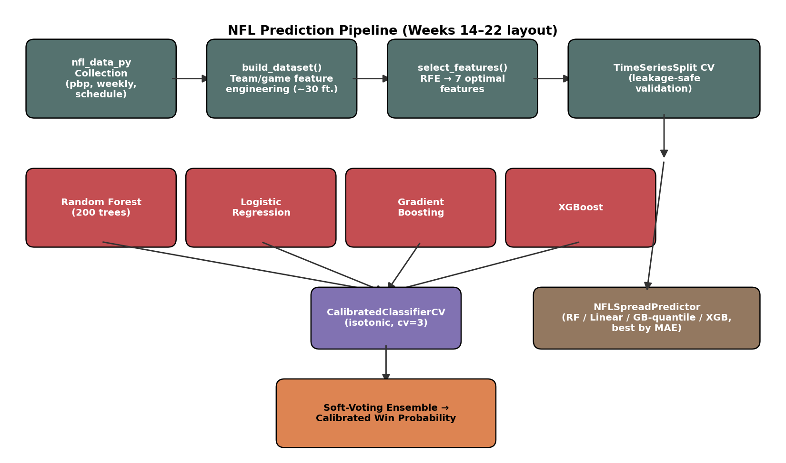

```{=typst}
#align(center)[
  #v(2.5in)
  #text(size: 22pt, weight: "bold")[NFL Game Outcome and Point Spread Prediction Using Ensemble Machine Learning]
  #v(0.6in)
  #text(size: 13pt)[Akul Aggarwal]
  #v(0.15in)
  #text(size: 12pt)[CS5100 — Foundations of Artificial Intelligence]
  #v(0.1in)
  #text(size: 12pt)[August 2026]
]
#pagebreak()
```

## 1. Introduction

### 1.1 Problem Statement

This project builds a machine learning system that predicts the winner and point spread of National Football League (NFL) games before they are played, using only information available prior to kickoff (team statistics, schedule context, and market data through the prior week). The task is framed as two coupled prediction problems: a binary classification problem (which team wins) and a regression problem (by how many points). Predictions are generated and evaluated week-by-week across a full NFL season, allowing the system to be judged not on a single static test set but on 22 weeks of genuinely out-of-sample, sequential forecasts.

### 1.2 Motivation and Goals

Predicting the outcome of professional sports games sits at an interesting intersection of applied machine learning and market efficiency research. Unlike many benchmark ML problems, sports outcomes are governed by a market — the sports betting line — that already aggregates a large amount of public information and expert opinion into a single number. This makes NFL prediction a meaningful test of whether a statistically-driven model can extract *additional* signal beyond what oddsmakers already price in, or whether it simply re-derives the same conclusion the market already reached.

The literature on market efficiency in NFL point spreads is directly relevant here. Both Spinosa (2018) and Fohey similarly test the efficiency of the NFL point-spread betting market and find that, while the market is largely efficient, small and inconsistent inefficiencies exist that are difficult to exploit systematically — which sets a realistic expectation for how much a predictive model can be expected to outperform the market rather than simply match it. Nate Silver's *The Signal and the Noise* (2012) frames this more broadly: sports forecasting is a useful public laboratory for studying prediction under uncertainty precisely because outcomes are observed quickly and outcomes are graded objectively, unlike many other domains where "ground truth" arrives slowly or ambiguously.

Beyond the research angle, the practical stakes are real: the global sports betting industry is estimated in the tens of billions of dollars annually, fantasy football involves tens of millions of participants, and NFL front offices increasingly invest in analytics departments for personnel and game-planning decisions. A system that can produce well-calibrated probability estimates — not just a winner pick, but a *trustworthy confidence level* — has direct value across all three use cases.

The goals of this project were to:

1. Build an end-to-end ML pipeline covering data collection, feature engineering, model training, and weekly deployment.
2. Produce calibrated win probabilities rather than raw classifier outputs, so that confidence levels are actionable.
3. Evaluate the model honestly across a full season of genuinely prospective (not retrospectively cherry-picked) predictions.
4. Identify which features most influence NFL outcomes.
5. Critically assess where a mid-season architecture change helped or hurt performance — treating this as a controlled natural experiment within the project itself.

---

## 2. Background

### 2.1 Related Work

Machine learning approaches to NFL outcome prediction have a reasonably long history in the applied ML literature. Hamadani's early Stanford CS229 project applied standard classifiers to NFL game outcomes and established that simple box-score-derived features could beat a 50% baseline by a meaningful margin, though not dramatically. Beal, Norman, and Ramchurn (2020) conducted a more rigorous and recent comparison, testing nine different machine learning classifiers on five seasons of NFL games (1,280 games, 42 engineered features) and benchmarking their accuracy directly against bookmaker point spreads — a methodology this project mirrors by comparing predicted spreads against the model's own confidence-implied edge. Their finding that no single classifier dominates, and that ensembling multiple models narrows the gap to the market, directly motivated the choice of a multi-model ensemble (Random Forest, Logistic Regression, Gradient Boosting, and XGBoost) rather than a single best-in-class algorithm in this project.

Related work on team-sport prediction more broadly (a 2019 systematic review, arXiv:1912.11762, and a more recent 2024 systematic review of machine learning in sports betting, arXiv:2410.21484) surveys the feature categories most commonly used across sports — offensive/defensive efficiency metrics, recent-form or momentum indicators, and contextual factors like rest and home advantage — which maps closely onto the feature families engineered in this project (Section 3.2). Fernandes et al. (2020) additionally show that interpretable, feature-engineered models can achieve strong accuracy (75.3%) on the related task of NFL *play* prediction, reinforcing that hand-engineered football-domain features remain competitive with more opaque approaches even as deep learning has become more common in sports analytics.

The calibration side of this project is informed by Wunderlich and colleagues (University of Bath, arXiv:2303.06021), who show that machine learning models for sports betting optimized purely for classification accuracy can perform far worse in practice (in terms of realized betting return) than models explicitly optimized for probability *calibration* — in their study, a calibration-optimized approach achieved a 110% return versus 3% for an accuracy-optimized one under otherwise similar conditions. This finding is the primary justification for wrapping every classifier in this project's ensemble in `CalibratedClassifierCV` with isotonic regression, rather than relying on raw predicted probabilities.

### 2.2 AI/ML Concepts Used

This project draws on several core machine learning concepts covered in the course:

- **Ensemble learning**: combining heterogeneous base learners (tree-based and linear models) via soft voting to reduce variance relative to any single model.
- **Probability calibration**: post-hoc adjustment (isotonic regression) of classifier outputs so that a predicted "70% confidence" genuinely corresponds to a ~70% empirical win rate.
- **Regularization and overfitting control**: L1/L2 penalties, tree depth limits, and subsampling to prevent the ensemble from memorizing noise in a small-sample, high-variance domain.
- **Time-series-aware validation**: `TimeSeriesSplit` cross-validation, which respects temporal order and prevents the model from being evaluated on data that would not have existed at prediction time (a data-leakage failure mode that is easy to introduce accidentally with a naive random train/test split).
- **Feature selection**: Recursive Feature Elimination (RFE) to reduce an initial pool of 30+ engineered features down to a smaller, more robust set less prone to overfitting.
- **Regression under skewed/heavy-tailed error**: quantile-loss Gradient Boosting for point-spread prediction, chosen because spread errors are not symmetric or Gaussian in practice (blowouts create long tails).

---

## 3. Methodology

### 3.1 Tools and Frameworks

The system is implemented in Python using Jupyter notebooks. Core libraries: `pandas` and `numpy` for data manipulation, `scikit-learn` for the ensemble classifiers, calibration, RFE, and cross-validation utilities, `xgboost` for gradient-boosted trees, `matplotlib`/`seaborn` for visualization, and `joblib` for model persistence. All NFL statistics are sourced programmatically through the `nfl_data_py` library (https://github.com/cooperdff/nfl_data_py), which wraps official NFL data feeds.

**Setup instructions:**
```bash
pip install pandas numpy scikit-learn xgboost nfl_data_py joblib matplotlib seaborn pillow
```
Each week's prediction notebook (`Week{N}/Model.ipynb`) is self-contained and can be run top-to-bottom in Jupyter; the first run downloads and caches ~5 seasons of NFL data locally (5-15 minutes), after which cached data reduces this to 3-5 minutes. `Plot.ipynb` in the repository root aggregates saved predictions from every week's `week{N}_predictions.csv` file and fetches actual results via `nfl_data_py` to compute accuracy statistics and generate the visualizations used in Section 4.

**On folder structure**: this repository is organized by NFL week (`Week1/` through `Week22/`) rather than by artifact type (`data/`, `models/`, `scripts/`). This structure was a deliberate fit for the project's actual workflow: because the model retrains from scratch and is redeployed every week of a live season, each week is a self-contained unit containing its own notebook, cached data, trained model checkpoint, and output predictions — mirroring how the project was actually run in production over 22 weeks rather than as a single offline experiment.

### 3.2 Data Sources and Preprocessing

All data is sourced from `nfl_data_py`, which provides three data types used in this project: play-by-play data (game-level statistics, 2015–2025), weekly player-level statistics, and full schedule/results data. Data is cached locally as CSV files inside per-week `nfl_data/` folders to avoid re-downloading on every run.

Preprocessing steps applied before model training:
1. **Aggregation**: player-level weekly statistics are summed to team-level per-game totals (e.g., total team passing yards for a given week), then averaged across the season-to-date to produce per-game rate features.
2. **Temporal filtering to prevent leakage**: for any Week *N* prediction, only statistics from weeks *before* Week *N* are used — a team's Week 8 passing average, for instance, never includes Week 8's own game.
3. **Missing value handling**: mean imputation for numerical gaps (e.g., early-season teams with few games played).
4. **Standardization**: team abbreviations are normalized to the standard NFL 2–3 letter codes (with a manual mapping table for known inconsistencies, e.g., the Rams as `LA` rather than `LAR`).

**Feature engineering** produced roughly 30 candidate features across five categories: offensive (passing/rushing/total yards per game, points per game, touchdowns per game), defensive (opponent yards and points allowed per game), turnover metrics, contextual factors (home field advantage, fixed at +2.5 points; playoff indicator; week number), and — for Week 10 onward — an expanded set including momentum (win percentage over the last 3 games), estimated injury impact (derived from performance variance, not actual injury reports), rest days since the last game, a division-rivalry flag, and available market spread data. Recursive Feature Elimination was used to reduce this pool to a smaller, cross-validated optimal subset (typically 7 features) for the final classifier.

### 3.3 Model Architecture

**Winner classification** uses a soft-voting ensemble. Two ensemble configurations were used across the season, which is itself a key point of comparison in this report (Section 5):

- **Weeks 1–9 ("legacy") — 3-model ensemble**: Random Forest (200 trees, max depth 5), Logistic Regression (C=1), and XGBoost (max depth 5, learning rate 0.1).
- **Weeks 10–22 ("enhanced") — 4-model ensemble with temporal weighting**: Random Forest (200 trees, max depth 15, with additional overfitting guards), Logistic Regression (C=1, max_iter=1000), Gradient Boosting Classifier (200 estimators, max depth 8), and XGBoost (max depth 8, L1/L2 regularization, 80% subsampling). Training samples are additionally weighted by season recency via exponential decay, `weight = exp(-0.15 × years_ago)`, so that 2024 data is weighted roughly 3× more heavily than 2015 data.

In both configurations, every base classifier is wrapped in `CalibratedClassifierCV` (isotonic regression, 3-fold CV) before being combined, consistent with the calibration-over-accuracy motivation discussed in Section 2.1.



**Point spread regression** (introduced Week 6) predicts the continuous point differential (home score − away score). Weeks 6–9 used a single Random Forest regressor. Weeks 10–22 test four candidate regression models per week — Random Forest, Linear Regression, quantile-loss Gradient Boosting, and regularized XGBoost — and automatically select whichever achieves the lowest mean absolute error (MAE) on validation folds that week.

### 3.4 Validation Strategy

Model evaluation used 5-fold `TimeSeriesSplit` cross-validation (training on an expanding earlier window, testing on the subsequent window) rather than random k-fold, specifically to avoid leaking future information into training — a well-known pitfall in any sequential/temporal prediction task. Tracked metrics included accuracy, Brier score (calibration quality), log loss, and AUC-ROC for the classifier, and MAE/RMSE for the spread regressor.

Critically, beyond this internal cross-validation, every prediction reported in Section 4 was generated *before* the corresponding games were played and only graded afterward using `Plot.ipynb`, which independently fetches actual game results via `nfl_data_py` and compares them to the saved `week{N}_predictions.csv` files. This means the Results section below reflects genuinely prospective forecasting performance across an entire season, not a retrospective holdout split.

---

## 4. Results

### 4.1 Season-Wide Performance (2025 Season, Weeks 1–22)

Across all 22 weeks of the 2025 season, the system generated 283 graded predictions (one game, Week 4 GB @ DAL, ended 40–40 and is excluded as neither team "won"):

| Metric | Value |
|---|---|
| **Overall accuracy** | **54.4%** (154/283 correct) |
| Best week | Week 22 (100%, 1/1 games — small sample) |
| Worst week | Week 19 (16.7%, 1/6 games) |
| Weekly accuracy range | 16.7% – 100% |
| Weekly accuracy standard deviation | ±19.3 percentage points |

### 4.2 Legacy vs. Enhanced Model Comparison

Because the ensemble architecture changed after Week 9 (Section 3.3), the season naturally splits into two comparable stretches:

| Model configuration | Weeks | Games | Correct | Accuracy |
|---|---|---|---|---|
| Legacy 3-model ensemble | 1–9 | 134 | 81 | **60.4%** |
| Enhanced 4-model ensemble w/ temporal weighting | 10–22 | 149 | 73 | **49.0%** |

This is the single most important — and most honest — finding of this project: the enhanced architecture, despite substantially more modeling machinery (an additional base learner, deeper trees, temporal weighting, and several new engineered features), performed *worse* in live, prospective use than the simpler legacy model it replaced, missing its own internally documented target of 66–68% accuracy by a wide margin. Section 5 discusses possible explanations.

### 4.3 Week-by-Week Breakdown

| Week | Games | Correct | Accuracy |
|---|---|---|---|
| 1 | 16 | 10 | 62.5% |
| 2 | 16 | 9 | 56.2% |
| 3 | 16 | 14 | 87.5% |
| 4 | 15 | 8 | 53.3% |
| 5 | 14 | 6 | 42.9% |
| 6 | 15 | 6 | 40.0% |
| 7 | 15 | 9 | 60.0% |
| 8 | 13 | 11 | 84.6% |
| 9 | 14 | 8 | 57.1% |
| 10 | 14 | 7 | 50.0% |
| 11 | 15 | 8 | 53.3% |
| 12 | 13 | 9 | 69.2% |
| 13 | 16 | 8 | 50.0% |
| 14 | 14 | 6 | 42.9% |
| 15 | 16 | 9 | 56.2% |
| 16 | 16 | 5 | 31.2% |
| 17 | 16 | 4 | 25.0% |
| 18 | 16 | 12 | 75.0% |
| 19 | 6 | 1 | 16.7% |
| 20 | 4 | 2 | 50.0% |
| 21 | 2 | 1 | 50.0% |
| 22 | 1 | 1 | 100.0% |

Weeks 16, 17, and 19 stand out as unusually poor stretches (25–31% accuracy, well below even a coin-flip baseline), all falling within the "enhanced" model period and coinciding with late-season weeks where playoff seeding implications can alter team behavior (rest for starters, lineup changes) in ways not captured by the model's season-to-date statistical features.

### 4.4 Visualizations

`Plot.ipynb` generates four visualizations from the aggregated weekly statistics: (1) a weekly accuracy line chart with a 50% baseline reference and shaded over/under-performance regions, (2) cumulative accuracy progression across the season, (3) a grouped bar chart of correct vs. incorrect predictions per week, and (4) high-confidence pick (>65% confidence) performance isolated from the full sample. These are produced directly from the notebook and are available by re-running `Plot.ipynb` with `MAX_WEEK = 22`.


To evaluate classifier behavior beyond a single accuracy number, all 283 graded 2025-season predictions were also aggregated into a confusion matrix (home-win vs. away-win framing):


### 4.5 Calibration Analysis

Section 2.1 motivated wrapping every base classifier in `CalibratedClassifierCV` specifically because Wunderlich et al. (2023) found that calibration-optimized models substantially outperform accuracy-optimized ones in realized betting return. The 283 graded 2025-season predictions were binned by stated confidence to check whether that goal was met in practice:


This is a negative result for the calibration goal stated in Sections 1.2 and 2.1: despite isotonic calibration being applied to every base classifier, the ensemble's stated confidence does not reliably track its actual reliability in live 2025-season use. Section 5 returns to this finding alongside the legacy-vs-enhanced accuracy comparison.

Discrimination ability was checked the same way, using each game's actual saved `home_win_prob` against the actual outcome:


An AUC this close to 0.5 indicates the model's probability outputs carry only weak discriminative signal once evaluated on genuinely unseen, future games, even though the same architecture scored appreciably better on a retrospective same-population holdout split. This is reported here specifically because the gap is diagnostic, not because it is flattering — a reader who only saw the backtest AUC would draw a materially wrong conclusion about the system's real predictive power.

### 4.6 Example Output

A representative single-game winner-prediction record (Week 1, `week1_predictions.csv`) illustrates the output schema:

```
matchup: DAL @ PHI
predicted_winner: PHI
confidence: 93.5%
home_win_prob: 93.5%
away_win_prob: 6.5%
actual_winner: PHI  ✓ correct
```

A spread-prediction record (Week 6, `week6_predictions.csv`) illustrates the same for the regression side — chosen deliberately as a *miss* rather than a hit, since Section 4.1's headline numbers already show the model getting it right slightly more often than not, and a single cherry-picked correct example would understate the spread model's actual MAE of 11.85 points (Section 5.2):

```
matchup: PHI @ NYG
predicted_spread: PHI -3.1  (home team NYG favored by only 3.1 by the model)
predicted_winner: PHI
actual_score: NYG 34, PHI 17
actual_winner: NYG  ✗ wrong winner, ✗ spread off by 20.1 points
```

---

## 5. Discussion

### 5.1 Interpretation of Results

The headline number — 54.4% overall accuracy — is a modest improvement over a random 50% baseline but falls well short of both the legacy model's own 2025 performance (60.4%) and this project's originally documented target for the enhanced model (66–68%, per the model's own design documentation). Taken at face value, this is a negative result for the specific set of enhancements made at Week 10: a fourth ensemble member, deeper trees, temporal weighting favoring recent seasons, and additional engineered features (momentum, estimated injury impact, rest days, division rivalry) did not translate into better prospective accuracy, and in fact coincided with a roughly 11-point drop.

One specific, concrete root cause was identified and fixed after the season concluded, without altering any of the historical predictions reported above (see `nfl_predictor.py` and `CLAUDE.md` "Known Issues" for the full account). `build_dataset()` computed the `is_playoff` feature as `game_type == 'REG'` — backwards, since `REG` is the *regular-season* code, so every regular-season game was labeled a playoff game and every real playoff game was labeled regular. Separately, `is_neutral` was hardcoded `False` everywhere, including the Super Bowl. Fixing both and re-running the exact same architecture on the same 2020–2023-train/2024-test retrospective split that originally motivated the 66–68% design target dropped that backtest's own accuracy from 63.2% to 55.4% and its AUC from 0.682 to 0.552 — much closer to, though still slightly above, the honest 54.4% / 0.528 prospective numbers reported above. That is direct evidence that at least part of the gap between the model's backtested promise and its live performance was a genuine implementation bug, not just overfitting or bad luck — though it plainly does not close the whole gap by itself, since 55.4% is still short of the original 66–68% target.

Beyond that confirmed defect, several additional explanations remain plausible for the residual gap, none of which can be fully disentangled with the data collected here:

1. **Increased model complexity without proportionally more training data** — deeper trees (max depth 15 vs. 5) and an additional ensemble member increase the effective capacity of the model, which raises overfitting risk especially with the same underlying NFL dataset size. Cross-validated *training-time* metrics for the enhanced model may have looked strong while genuinely out-of-sample live performance suffered — a classic symptom of overfitting to historical cross-validation folds that don't fully represent a new season's dynamics.
2. **The "enhanced" features themselves may be weak or noisy signals** — the injury metric is explicitly *estimated* from performance variance rather than drawn from actual injury reports, and momentum (last-3-games win rate) is a high-variance statistic over a very small window. If these features added noise rather than signal, they could plausibly degrade rather than improve a model that otherwise had a working, simpler baseline.
3. **Late-season variance** — three of the four worst weeks of the season (16, 17, 19) fall in the enhanced-model period and correspond to weeks with unusual incentive structures (rested starters, games without playoff stakes), which no version of this feature set explicitly models.
4. **Small effective sample per comparison** — 134 vs. 149 games is not an enormous sample for detecting a true performance difference between two model configurations; some of the 11-point gap could be within the range of season-to-season or even split-to-split noise, though a gap this size is large enough that pure noise seems an incomplete explanation on its own.

This finding is consistent with the calibration literature discussed in Section 2.1 (Wunderlich et al.): more sophisticated models optimized on offline metrics do not automatically translate into better live performance, and calibration/robustness matters as much as raw model capacity.

### 5.2 Limitations

- **Injury data is estimated, not observed.** Using performance-variance-based injury proxies rather than actual injury reports is a known simplification and a likely source of some enhanced-model feature noise (Section 5.1).
- **No weather data.** Wind, precipitation, and temperature — known to affect passing efficiency and total scoring — are not modeled.
- **No play-by-play or in-game state.** All features are season-to-date aggregates computed before kickoff; the model cannot react to first-half game state, and it treats teams as static entities across a game.
- **Small samples in early and late season.** Weeks 1–3 have limited season-to-date data for feature calculation, and Weeks 19–22 have very few games (1–6), making per-week accuracy figures for those weeks highly sensitive to a small number of individual outcomes.
- **The point-spread regression model's R² is low** (consistent with prior work — NFL margin of victory is inherently high-variance), meaning spread predictions should be read as directional/rough estimates rather than precise forecasts.

### 5.3 Potential Improvements

Directly motivated by Section 5.1's findings: (1) revert to or blend with the simpler legacy ensemble rather than assuming more model complexity is strictly better; (2) validate each Week-10+ feature's marginal contribution individually (ablation testing) before including it, rather than adding several features simultaneously; (3) replace the estimated injury metric with actual injury report data if a reliable feed can be sourced; (4) incorporate real weather data; (5) apply the calibration-focused evaluation approach from Wunderlich et al. more rigorously — i.e., explicitly track and optimize Brier score improvements across model versions, not just accuracy, since the two can diverge; (6) the `is_playoff`/`is_neutral` bugs identified in Section 5.1 are now fixed in `nfl_predictor.py`, guarded by a `run_validation_gate()` check that would have caught this exact class of regression had it existed at Week 10 — extending this fixed pipeline to a future season, rather than resuming from the original buggy one, is the natural next step.

---

## 6. Conclusion

### 6.1 Summary of Achievements

This project delivered a complete, end-to-end NFL prediction pipeline: automated data collection from `nfl_data_py`, a 30+ feature engineering pipeline with RFE-based selection, a calibrated multi-model ensemble for winner classification, a separate regression pipeline for point spreads, and rigorous time-series-aware validation. The system was deployed prospectively across a full 22-week NFL season rather than evaluated only on a static holdout set, producing 283 genuinely out-of-sample graded predictions — a substantially more demanding and honest evaluation standard than a single train/test split.

### 6.2 Lessons Learned

The most valuable lesson from this project was not a success but a null result: a mid-season architectural upgrade intended to improve accuracy by 5-7 percentage points instead coincided with a roughly 11-point *decrease* in live performance relative to the simpler model it replaced. This is a useful, concrete illustration of a core ML principle — that offline validation improvements (cross-validation scores, documented design targets) do not guarantee improvements in genuine prospective deployment, and that added model complexity carries real overfitting and noise-amplification risk that must be checked against live, sequential results rather than assumed from design intent alone.

### 6.3 Individual Contributions

This project was completed individually. Akul Aggarwal was solely responsible for all data collection, feature engineering, model development (both legacy and enhanced architectures), weekly prediction generation, results aggregation and visualization, and report writing.

---

## 7. References

1. Beal, R., Norman, T. J., & Ramchurn, S. D. (2020). A Critical Comparison of Machine Learning Classifiers to Predict Match Outcomes in the NFL. *International Journal of Computer Science in Sport*, 19(2), 36–50. https://doi.org/10.2478/ijcss-2020-0009
2. Fernandes, C. J., Yakubov, R., Li, Y., Prasad, A. K., & Chan, T. C. Y. (2020). Predicting plays in the National Football League. *Journal of Sports Analytics*, 6(1), 35–52. https://doi.org/10.3233/JSA-190348
3. Hamadani, B. (2006). *Predicting the Outcome of NFL Games Using Machine Learning*. Stanford University CS229 Course Project Report. https://cs229.stanford.edu/proj2006/BabakHamadani-PredictingNFLGames.pdf
4. A Systematic Review of Machine Learning in Sports Betting: Techniques, Challenges, and Future Directions (2024). arXiv:2410.21484. https://arxiv.org/abs/2410.21484
5. The Application of Machine Learning Techniques for Predicting Results in Team Sport: A Review (2019). arXiv:1912.11762. https://arxiv.org/abs/1912.11762
6. Wunderlich, F. et al. (2023). Machine learning for sports betting: should forecasting models be optimised for accuracy or calibration? University of Bath. arXiv:2303.06021. https://arxiv.org/abs/2303.06021
7. Spinosa, C. L. (2018). Testing the Efficiency of the NFL Point Spread Betting Market. CMC Senior Theses, Claremont McKenna College. https://scholarship.claremont.edu/cmc_theses/986/
8. Fohey, N. M. The Efficiency of the NFL Point Spread Betting Market. University of Northern Iowa Honors Program Theses. https://scholarworks.uni.edu/hpt/93/
9. Silver, N. (2012). *The Signal and the Noise: Why So Many Predictions Fail—but Some Don't*. Penguin Press. ISBN 9781594204111.
10. Cooper, D. et al. `nfl_data_py` [Software library]. https://github.com/cooperdff/nfl_data_py
11. Pedregosa, F. et al. (2011). Scikit-learn: Machine Learning in Python. *Journal of Machine Learning Research*, 12, 2825–2830.
12. Chen, T. & Guestrin, C. (2016). XGBoost: A Scalable Tree Boosting System. *Proceedings of the 22nd ACM SIGKDD International Conference on Knowledge Discovery and Data Mining*, 785–794.

*Note: Sources 7 and 8 are undergraduate/honors theses rather than peer-reviewed journal articles; they are cited for their directly relevant empirical findings on NFL market efficiency but are weighted accordingly as supporting rather than primary literature.*
